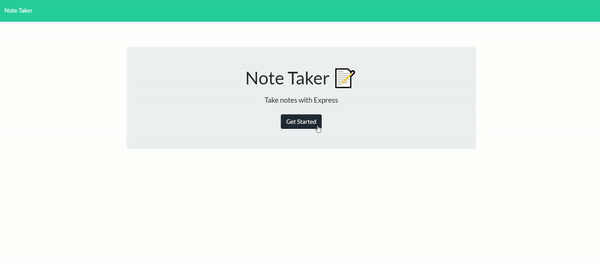

  # Note Taker 

  

  ## About Project

Note Taker that can be used to write and save notes. This application will use an Express.js back end and will save and retrieve note data from a JSON file.
  
## Table of Contents 
- [Installation](#Installation)
- [Usage](#Usage)
- [demo](#demo)
- [License](#License)
- [Repositorie](#Repositorie)

    
## Installation

*To make the code run install this code*

- npm install 
- npm install express
- npm install UUID

    
## Usage 
*Run this code to run the application*
- node server.js

## Demo

## License 

- Licensed under the MIT License. 

## Repositorie 
---
- github: https://github.com/rammohanmiryala/Note-Taker.git

- herokuapp : https://ram-note-taker.herokuapp.com/
  
